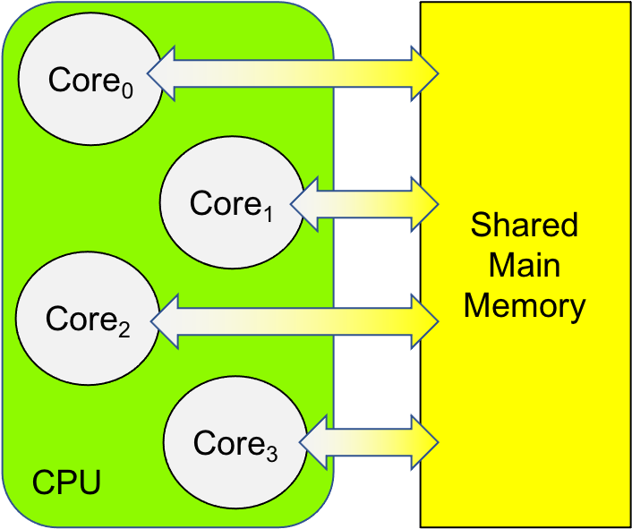
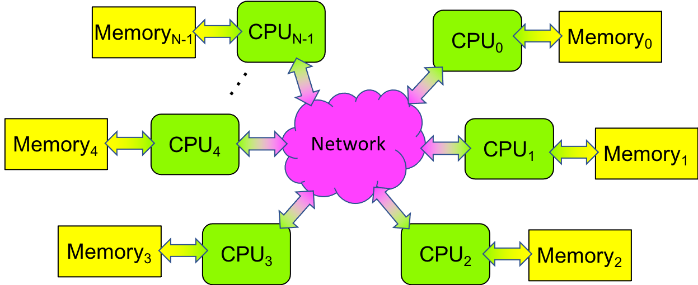
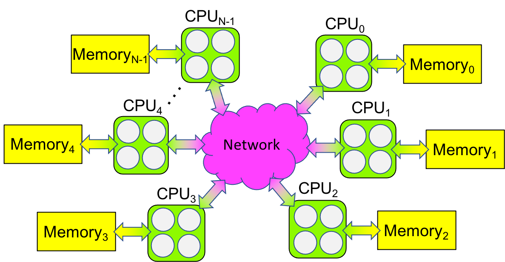

.. This section contains a brief history of parallel computing, and its modern uses. Questions that we should be answering:

.. * what is it used for?
.. * why should students care?
.. * what can students expect to learn by the end of this book?

0.0 Computing
--------------------------------
Welcome to *Parallel Computing for Beginners*! This chapter will start you on your parallel computing journey, laying the conceptual foundations needed for the chapters that follow. 

If you are reading this book, you are probably familiar with the term *computing*, which we might define as *designing, writing, and/or running software in order to solve a problem*. Let’s examine each of these in turn:

1. *Designing* software consists of carefully specifying what must be done to solve the problem, and then devising an *algorithm* — a series of well-defined steps—that solves the problem. 

2. *Writing* software consists of implementing an algorithm in a particular programming language, which results in a *computer program*. This program must be thoroughly *tested* to ensure that it actually solves the problem; otherwise, it may be necessary to revisit one’s design and start anew.

3. *Running* software consists of having a *computer perform the program’s statements*. When we are confident that a program correctly solves the problem, we can the problem by running the program on a computer.

Computing thus consists of two parts: (i) the *software* or program that is being used to solve a problem, and (ii) the *hardware* or computer on which the software is being run.

0.1 Computing Hardware
--------------------------------

The hardware component of a computer that performs a program’s statements is called the **central processing unit (CPU)**. The CPU contains the circuitry needed to perform arithmetic and logical operations. This circuitry is sometimes called the CPU’s **core**.

Prior to 2005, the CPUs in most computers had a single core, so they could only perform one program statement at a time. By default, a core performs a program’s statements one after another—as a sequence—so this kind of computing was known as **sequential computing** and the programs written for single core CPUs were **sequential programs**.

In 2005, CPU manufacturers began building CPUs with multiple cores - **multicore CPUs** - that could perform multiple statements at the same time. The first generation of these CPUs had two cores and were known as dual-core CPUs; the next generation had four cores and were known as quad-core CPUs; and so on. Today, one can buy 64- and 128-core CPUs!

A computer that can perform more than one statement at a time is called a **multiprocessor**. Today’s multicore CPUs are one kind of multiprocessor, but multiprocessors have existed since the 1960s, when some mainframe computers had multiple CPUs. In the 1970s and 80s, companies like Cray Research built multiprocessors that were the first supercomputers. In the 1990s, researchers at NASA built their own multiprocessor by taking sixteen personal computers 
and connecting them with Ethernet, a standard networking technology. The NASA researchers called their multiprocessor a **Beowulf cluster**.

Multiprocessors fall into one of three categories:

1. If a multiprocessor has multiple cores that share the same main memory, then the system is called a **shared memory multiprocessor**. Figure 0-1 illustrates such a system. The vast majority of today’s personal computers—including desktops, laptops, tablets, smartphones, and single board computers like the Raspberry Pi—have multiple cores, making them shared memory multiprocessors.

   Figure 0-1: Shared Memory Multiprocessor Diagram

2. If a multiprocessor has multiple CPUs, each with its own local memory, but no memory in common, then the system is called a **distributed memory multiprocessor**. In such a computer, the CPUs are connected via a network, to facilitate communication between the CPUs. Figure 0-2 illustrates such a system. The first Beowulf clusters were distributed memory multiprocessors.

   Figure 0-2: Distributed Memory Multiprocessor Diagram

3. If a distributed memory multiprocessor’s CPUs are shared memory multiprocessors (e.g., it has multicore CPUs), and/or they use graphics processing units GPUs) to accelerate a computation, then the computer is called a **heterogeneous multiprocessor**. Figure 0-3 illustrates how such a system differs from the others. Most of today’s supercomputers are heterogeneous multiprocessors—in essence, Beowulf clusters with multicore CPUs and hardware accelerators.

   Figure 0-3: Heterogeneous Multiprocessor Diagram

In Section 0.0, we saw that *computing* involves designing, implementing, and then running a program on a computer. As we shall see next, the kind of computer on which you will be running your program affects how you design and implement the program.

0.2: Parallel Computing
-------------------------

If you run a traditional sequential program on a multiprocessor, that program will only utilize one of the CPU’s cores. That is, if you have a laptop with an 8-core CPU but run a traditional sequential program on it, you are only using 1/8 of your laptop’s capabilities! Sequential computing thus squanders much of the potential of a modern multiprocessor.

**Parallel computing** is *designing, writing, and running software that solves a problem in a way that takes advantage of a multiprocessor’s parallel capabilities*. 

To utilize the hardware of a multiprocessor efficiently, the software has to be designed and written to take advantage of that multiprocessor’s hardware. When this is the case, the software is called *parallel software* and the resulting program is called a *parallel program*. Unlike a sequential program, a parallel program seeks to utilize the parallel capabilities of a multiprocessor as efficiently as possible.

Some problems are very time-consuming to solve sequentially. A few of these include:

* weather forecasting
* earthquake prediction
* quantum mechanics
* astronomy data analysis (e.g., cosmos evolution) 
* geological data analysis (e.g., oil exploration)
* molecular modeling (e.g., drug design)
* genomic data analysis (e.g., genetic sequencing)
* cryptology (e.g., decrypting encrypted messages)

These kinds of problems might take weeks, months, or years to solve on a normal computer, but by designing and writing the solutions as parallel software, and running that software on a multiprocessor, the problems can be solved much more quickly.

As we saw in the last section, there are three different kinds of multiprocessors: shared memory, distributed memory, and heterogeneous. These three kinds of multiprocessors are sometimes called **multiprocessor platforms**. Unfortunately, when it comes to writing software, there is no "one size fits all" approach that works for all three platforms. Each kind of multiprocessor is so different from the others, the software for a given platform must be designed and written separately, if we want to use that platform as efficiently as possible. In the subsequent chapters of this book, each chapter focuses on how to design and write software for a particular multiprocessor platform.

